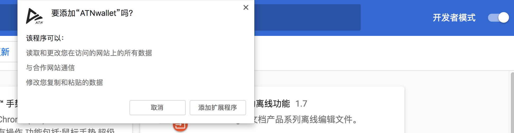

# atn-wallet Browser Extension

atn-wallet forks [metamask](metamask.md) to reuse the most features

Node version recommand: 8.11.3

## Quick Start

Download atn wallet chrome extension from [release-page](https://github.com/ATNIO/atn-wallet/releases)

Install steps:
- Open your chrome explorer and go to `chrome://extensions/` page.
- Ensure that the `Developer mode` checkbox in the top right-hand corner is checked.
- Drag downloaded atn wallet extension `atn_wallet-chrome-vx.x.x.crx` to finish installation:


Enjoy your atn wallet now.

## Development & Publishing

```bash
# for development
npm install 
npm start

# for publishing
npm run dist
```

## Other Docs

- To be continue


